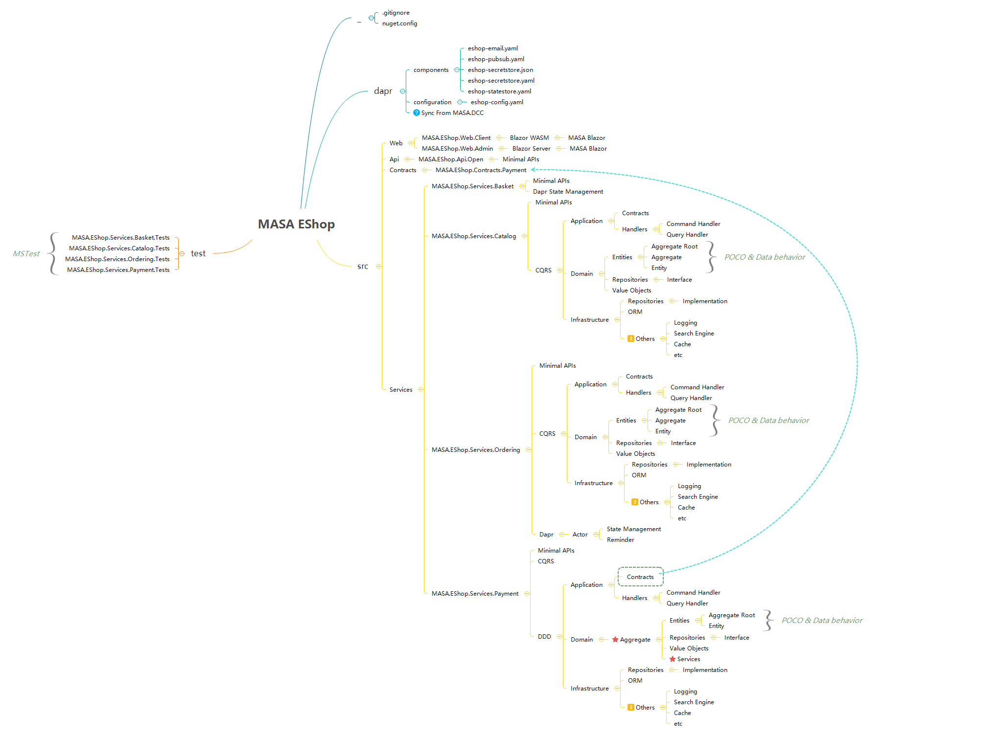
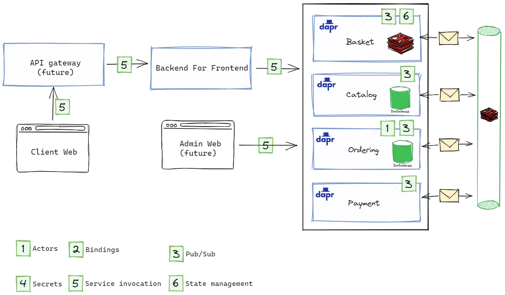
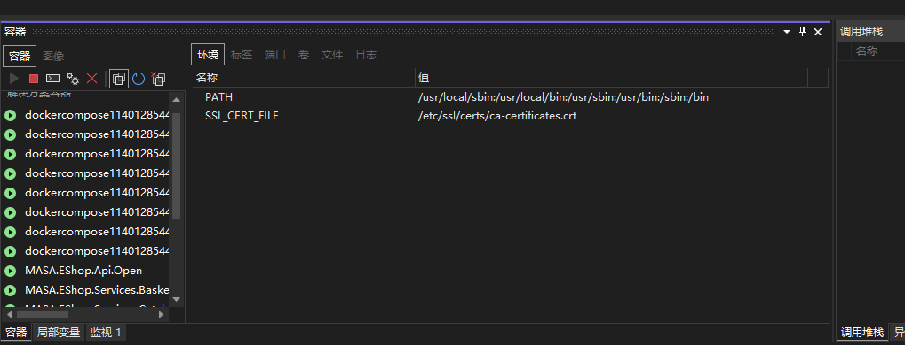

[中](README.zh-CN.md) | EN
# <center>MASA.EShop</center>

# Introduction

A sample `.NET Core` distributed application based on eShopOnDapr, powered by [MASA.BuildingBlocks](https://github.com/masastack/MASA.BuildingBlocks), [MASA.Contrib](https://github.com/masastack/MASA.Contrib), [MASA.Utils](https://github.com/masastack/MASA.Utils),[Dapr](https://github.com/dapr/dapr).

## Directory Structure

```
MASA.EShop
├── dapr
│   ├── components                           dapr local components directory
│   │   ├── pubsub.yaml                      pub/sub config file
│   │   └── statestore.yaml                  state management config file
├── src                                      
│   ├── Api
│   │   └── MASA.EShop.Api.Open              BFF Layer, provide API to Web.Client
│   ├── Contracts                            Common contracts，like Event Class
│   │   ├── MASA.EShop.Contracts.Basket
│   │   ├── MASA.EShop.Contracts.Catalog
│   │   ├── MASA.EShop.Contracts.Ordering
│   │   └── MASA.EShop.Contracts.Payment
│   ├── Services
│   │   ├── MASA.EShop.Services.Basket
│   │   ├── MASA.EShop.Services.Catalog
│   │   ├── MASA.EShop.Services.Ordering
│   │   └── MASA.EShop.Services.Payment
│   ├── Web
│   │   ├── MASA.EShop.Web.Admin
│   │   └── MASA.EShop.Web.Client
├── test
|   └── MASA.EShop.Services.Catalog.Tests
├── docker-compose
│   ├── MASA.EShop.Web.Admin
│   └── MASA.EShop.Web.Client
├── .gitignore
├── LICENSE
├── .dockerignore
└── README.md                                
```

## Project Structure



## Project Architecture(Update later)



## Getting started

- Preparation

  - Docker
  - VS 2022
  - .Net 6.0
  - Dapr

- Startup

  - VS 2022(Recommended)

    Set docker-compose as start project, press `Ctrl + F5` to start.

    

    After startup, you can see the container view.

    

  - CLI

    Run the command in the project root directory.

    ```
    docker-compose build
    docker-compose up
    ```

    After startup, the output is as follows.

    

  - VS Code (Todo)

- Display after startup(Update later)

  Baseket Service: http://localhost:8081/swagger/index.html  
  Catalog Service: http://localhost:8082/swagger/index.html  
  Ordering Service: http://localhost:8083/swagger/index.html  
  Payment Service: http://localhost:8084/swagger/index.html

## Features

#### MinimalAPI

The service in the project uses the `Minimal API` added in .NET 6 instead of the Web API.

> For more Minimal API content reference [mvc-to-minimal-apis-aspnet-6](https://benfoster.io/blog/mvc-to-minimal-apis-aspnet-6/)

```C#
var builder = WebApplication.CreateBuilder(args);
var app = builder.Build();
app.MapGet("/api/v1/helloworld", ()=>"Hello World");
app.Run();
```

`MASA.Contrib.Service.MinimalAPIs` based on `MASA.BuildingBlocks`:

Program.cs
```C#
var builder = WebApplication.CreateBuilder(args);
var app = builder.Services.AddServices(builder);
app.Run();
```

HelloService.cs
```C#
public class HelloService : ServiceBase
{
    public HelloService(IServiceCollection services): base(services) =>
        App.MapGet("/api/v1/helloworld", ()=>"Hello World"));
}
```

> The `ServiceBase` class (like ControllerBase) provided by `MASA.BuildingBlocks` is used to define Service class (like Controller), maintains the route registry in the constructor. The `AddServices(builder)` method will auto register all the service classes to DI. Service inherited from ServiceBase is `similar to singleton pattern`. Such as `Repostory`, should be injected with the `FromService`.

#### Dapr

The official Dapr implementation, MASA.Contrib references the Event section.
 
More Dapr content reference: https://docs.microsoft.com/zh-cn/dotnet/architecture/dapr-for-net-developers/

1. Add Dapr

```C#
builder.Services.AddDaprClient();
...
app.UseRouting();
app.UseCloudEvents();
app.UseEndpoints(endpoints =>
{
    endpoints.MapSubscribeHandler();
});
```

2. Publish event

```C#
var @event = new OrderStatusChangedToValidatedIntegrationEvent();
await _daprClient.PublishEventAsync
(
    "pubsub",
    nameof(OrderStatusChangedToValidatedIntegrationEvent),
    @event
);
```

3. Sub event

```C#
 [Topic("pubsub", nameof(OrderStatusChangedToValidatedIntegrationEvent)]
 public async Task OrderStatusChangedToValidatedAsync(
     OrderStatusChangedToValidatedIntegrationEvent integrationEvent,
     [FromServices] ILogger<IntegrationEventService> logger)
 {
     logger.LogInformation("----- integration event: {IntegrationEventId} at {AppName} - ({@IntegrationEvent})", integrationEvent.Id, Program.AppName, integrationEvent);
 }
```

> `Topic` first parameter `pubsub` is the `name` field in the `pubsub.yaml` file.

#### Actor

1. Add Actor

```C#
app.UseEndpoints(endpoint =>
{
    ...
    endpoint.MapActorsHandlers();
});
```

2. Define actor interface and inherit IActor.

```C#
public interface IOrderingProcessActor : IActor
{
```

3. Implement `IOrderingProcessActor` and inherit the `Actor` class. The sample project also implements the `IRemindable` interface, and 'RegisterReminderAsync' method. 

```C#
public class OrderingProcessActor : Actor, IOrderingProcessActor, IRemindable
{
    //todo
}
```

4. Register Actor

```C#
builder.Services.AddActors(options =>
{
    options.Actors.RegisterActor<OrderingProcessActor>();
});
```

5. Invoke actor

```C#
var actorId = new ActorId(order.Id.ToString());
var actor = ActorProxy.Create<IOrderingProcessActor>(actorId, nameof(OrderingProcessActor));
```

#### EventBus

Only In-Process events.

1. Add EventBus

```C#
builder.Services.AddEventBus();
```

2. Define Event

```C#
public class DemoEvent : Event
{
    //todo 自定义属性事件参数
}
```

3. Send Event

```C#
IEventBus eventBus;
await eventBus.PublishAsync(new DemoEvent());
```

4. Hanle Event

```C#
[EventHandler]
public async Task DemoHandleAsync(DemoEvent @event)
{
    //todo
}
```

#### IntegrationEventBus

Cross-Process event, In-Process event also supported when `EventBus` is added. 

1. Add IntegrationEventBus

```C#
builder.Services
    .AddDaprEventBus<IntegrationEventLogService>();
//   .AddDaprEventBus<IntegrationEventLogService>(options=>{
//    	//todo
//   	options.UseEventBus();//Add EventBus
//	});
```

2. Define Event

```C#
public class DemoIntegrationEvent : IntegrationEvent
{
    public override string Topic { get; set; } = nameof(DemoIntegrationEvent);
    //todo
}
```

> `Topic` property is the value of the dapr `TopicAttribute` second parameter.

3. Send Event

```C#
public class DemoService
{
    private readonly IIntegrationEventBus _eventBus;

    public DemoService(IIntegrationEventBus eventBus)
    {
        _eventBus = eventBus;
    }

    //todo

    public async Task DemoPublish()
    {
        //todo
        await _eventBus.PublishAsync(new DemoIntegrationEvent());
    }
}
```

4. Handle Event

```C#
[Topic("pubsub", nameof(DemoIntegrationEvent))]
public async Task DemoIntegrationEventHandleAsync(DemoIntegrationEvent @event)
{
    //todo
}
```

#### CQRS

More CQRS content reference：https://docs.microsoft.com/en-us/azure/architecture/patterns/cqrs

##### Query

1. Define Query

```c#
public class CatalogItemQuery : Query<List<CatalogItem>>
{
	public string Name { get; set; } = default!;

	public override List<CatalogItem> Result { get; set; } = default!;
}
```

2. Add QueryHandler:

```c#
public class CatalogQueryHandler
{
    private readonly ICatalogItemRepository _catalogItemRepository;

    public CatalogQueryHandler(ICatalogItemRepository catalogItemRepository) => _catalogItemRepository = catalogItemRepository;

    [EventHandler]
    public async Task ItemsWithNameAsync(CatalogItemQuery query)
    {
        query.Result = await _catalogItemRepository.GetListAsync(query.Name);
    }
}
```

3. Send Query

```C#
IEventBus eventBus;// DI is recommended
await eventBus.PublishAsync(new CatalogItemQuery(){
	Name = "Rolex"
});
```

##### Command

1. Define Command

```c#
public class CreateCatalogItemCommand : Command
{
	public string Name { get; set; } = default!;

    //todo
}
```

2. Add CommandHandler：

```c#
public class CatalogCommandHandler
{
    private readonly ICatalogItemRepository _catalogItemRepository;

    public CatalogCommandHandler(ICatalogItemRepository catalogItemRepository) => _catalogItemRepository = catalogItemRepository;

    [EventHandler]
    public async Task CreateCatalogItemAsync(CreateCatalogItemCommand command)
    {
        //todo
    }
}
```

3. 发送 Command

```C#
IEventBus eventBus;
await eventBus.PublishAsync(new CreateCatalogItemCommand());
```

#### DDD

More DDD content reference:https://docs.microsoft.com/en-us/dotnet/architecture/microservices/microservice-ddd-cqrs-patterns/ddd-oriented-microservice

Both In-Process and Cross-Process events are supported.

1. Add DomainEventBus

```c#
.AddDomainEventBus(options =>
{
    options.UseEventBus()
        .UseUow<PaymentDbContext>(dbOptions => dbOptions.UseSqlServer("server=masa.eshop.services.eshop.database;uid=sa;pwd=P@ssw0rd;database=payment"))
        .UseDaprEventBus<IntegrationEventLogService>()
        .UseEventLog<PaymentDbContext>()
        .UseRepository<PaymentDbContext>();//使用Repository的EF版实现
})
```

2. Define DomainCommand(In-Process)

To verify payment command, you need to inherit DomainCommand or DomainQuery<>
```C#
public class OrderStatusChangedToValidatedCommand : DomainCommand
{
    public Guid OrderId { get; set; }
}
```

3. Send DomainCommand

```C#
IDomainEventBus domainEventBus;
await domainEventBus.PublishAsync(new OrderStatusChangedToValidatedCommand()
{
    OrderId = "OrderId"
});
```

4. Add Handler

```C#
[EventHandler]
public async Task ValidatedHandleAsync(OrderStatusChangedToValidatedCommand command)
{
    //todo
}
```

5. Define DomainEvent(Cross-Process))

```c#
public class OrderPaymentSucceededDomainEvent : IntegrationDomainEvent
{
     public Guid OrderId { get; init; }

    public override string Topic { get; set; } = nameof(OrderPaymentSucceededIntegrationEvent);

    private OrderPaymentSucceededDomainEvent()
    {
    }

    public OrderPaymentSucceededDomainEvent(Guid orderId) => OrderId = orderId;
}

public class OrderPaymentFailedDomainEvent : IntegrationDomainEvent
{
    public Guid OrderId { get; init; }

    public override string Topic { get; set; } = nameof(OrderPaymentFailedIntegrationEvent);

    private OrderPaymentFailedDomainEvent()
    {
    }

    public OrderPaymentFailedDomainEvent(Guid orderId) => OrderId = orderId;
}
```

6. Define domain service and send IntegrationDomainEvent(Cross-Process)

```c#
public class PaymentDomainService : DomainService
{
	private readonly ILogger<PaymentDomainService> _logger;

	public PaymentDomainService(IDomainEventBus eventBus, ILogger<PaymentDomainService> logger) : base(eventBus)
        => _logger = logger;

    public async Task StatusChangedAsync(Aggregate.Payment payment)
    {
        IIntegrationDomainEvent orderPaymentDomainEvent;
        if (payment.Succeeded)
        {
            orderPaymentDomainEvent = new OrderPaymentSucceededDomainEvent(payment.OrderId);
        }
        else
        {
            orderPaymentDomainEvent = new OrderPaymentFailedDomainEvent(payment.OrderId);
        }
        _logger.LogInformation("----- Publishing integration event: {IntegrationEventId} from {AppName} - ({@IntegrationEvent})", orderPaymentDomainEvent.Id, Program.AppName, orderPaymentDomainEvent);
        await EventBus.PublishAsync(orderPaymentDomainEvent);
    }
}
```

## Service Description

#### MASA.EShop.Services.Basket

1. Add [MinimalAPI](####MinimalAPI)
2. Add and use [Dapr](####Dapr)

#### MASA.EShop.Services.Catalog

1. Add [MinimalAPI](####MinimalAPI)
2. Add [DaprEventBus](####IntegrationEventBus)

```c#
builder.Services
.AddDaprEventBus<IntegrationEventLogService>(options =>
{
    options.UseEventBus()
           .UseUow<CatalogDbContext>(dbOptions => dbOptions.UseSqlServer("server=masa.eshop.services.eshop.database;uid=sa;pwd=P@ssw0rd;database=catalog"))
           .UseEventLog<CatalogDbContext>();
})
```

3. Use [CQRS](####CQRS)

#### MASA.EShop.Services.Ordering

1. Add [MinimalAPI](####MinimalAPI)
2. Add [DaprEventBus](####IntegrationEventBus)

```C#
builder.Services
.AddDaprEventBus<IntegrationEventLogService>(options =>
{
    options.UseEventBus()
           .UseUoW<OrderingContext>(dbOptions => dbOptions.UseSqlServer("Data Source=masa.eshop.services.eshop.database;uid=sa;pwd=P@ssw0rd;database=order"))
           .UseEventLog<OrderingContext>();
});
```

3. Use [CQRS](####CQRS)
4. Add [Actor](####Actor)
5. Modify docker-compse file

`docker-compose.yml` add `dapr` service;

```yaml
dapr-placement:
  image: 'daprio/dapr:1.4.0'
```

`docker-compose.override.yml` add command and port mapping.

```yaml
dapr-placement:
  command: ['./placement', '-port', '50000', '-log-level', 'debug']
  ports:
    - '50000:50000'
```

`ordering.dapr` service add command

```yaml
"-placement-host-address", "dapr-placement:50000"
```

#### MASA.EShop.Services.Payment

1. Add [MinimalAPI](####MinimalAPI)
2. Add [DomainEventBus](####DDD)

```C#
builder.Services
.AddDomainEventBus(options =>
{
    options.UseEventBus()
        .UseUow<PaymentDbContext>(dbOptions => dbOptions.UseSqlServer("server=masa.eshop.services.eshop.database;uid=sa;pwd=P@ssw0rd;database=payment"))
        .UseDaprEventBus<IntegrationEventLogService>()
        .UseEventLog<PaymentDbContext>()
        .UseRepository<PaymentDbContext>();
})
```

3. Use [CQRS](####CQRS)

4. Use [DDD](####DDD)

# Function Introduction

Update later

# Nuget Package Introduction

```c#
Install-Package MASA.Contrib.Service.MinimalAPIs //MinimalAPI
```

```c#
Install-Package MASA.Contrib.Dispatcher.Events //In-Process event
```

```c#
Install-Package MASA.Contrib.Dispatcher.IntegrationEvents.Dapr //Cross-Process event
Install-Package MASA.Contrib.Dispatcher.IntegrationEvents.EventLogs.EF //Local message table
```

```c#
Install-Package MASA.Contrib.Data.UoW.EF //EF UoW
```

```c#
Install-Package MASA.Contrib.ReadWriteSpliting.CQRS //CQRS
```

```c#
Install-Package MASA.BuildingBlocks.DDD.Domain //DDD相关实现
Install-Package MASA.Contrib.DDD.Domain.Repository.EF //Repository实现
```
